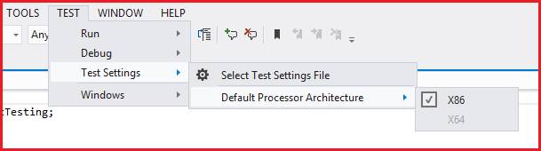

Friendly
========
Friendlyは、統合テストを作成するためのライブラリです。<br>
他のプロセスを操作する機能があります。<br>
Windowsアプリケーション(**WinForms**, **WPF**, and **Win32**)用に設計されています。<br>
Friendlyという名前は、C++ の friend クラスに由来します。 <br>
対象のプロセスとFriendになることでどのような操作でも可能にします。<br>

### [Driver/Scenarioパターン](TestAutomationDesign.jp.md)
SeleniumのPageObjectパターンと同じようにFriendlyを使った自動テストでも推奨される設計方針があります。[こちら](TestAutomationDesign.jp.md)も参照してください。

## .NetCore のアプリケーションも操作することができます。
Friendlyは、.NetCore WinFormsおよびWPFアプリも操作できます。テストコードも.NetCoreで書くことができます。Friendlyは.NetFrameworkでてきているので参照時にワーニングがでます。問題なく使えますのでワーニングを抑制してください。

## Features ...
### 別のプロセスのAPIを呼び出すことができます。
これは、SeleniumのJavaScript実行のようなものです。<br>
public internal protected private に関わらず、すべての Method、Property、Field を呼び出すことができます。
### DLL injection.
.Netのアセンブリを Dll Injection することができます。
インジェクションした dll に含まれるAPIは同様に呼び出し可能です。

## Getting Started
Install from NuGet<br>
WPF

    PM> Install-Package RM.Friendly.WPFStandardControls

WinForms

    PM> Install-Package Ong.Friendly.FormsStandardControls

Win32    

    PM> Install-Package Codeer.Friendly.Windows.NativeStandardControls

https://www.nuget.org/packages/Codeer.Friendly/

## Microsoft MVP Showcaseで2位を獲得しました。ありがとうございました！
http://blogs.msdn.com/b/mvpawardprogram/archive/2014/11/04/mvp-showcase-winners.aspx

## Simple sample
これは操作対象のWpfアプリです。何の仕掛けもない普通のWpfアプリです。
```xaml
<Window x:Class="Target.MainWindow"
        xmlns="http://schemas.microsoft.com/winfx/2006/xaml/presentation"
        xmlns:x="http://schemas.microsoft.com/winfx/2006/xaml"
        Title="MainWindow" Height="350" Width="525">
    <Grid>
        <TextBox x:Name="_textBox" Text="{Binding Path=TextData}"/>
    </Grid>
</Window>
```
```cs  
using System.ComponentModel;
using System.Windows;

namespace Target
{
    public partial class MainWindow : Window
    {
        public MainWindow()
        {
            InitializeComponent();
            this.DataContext = new VM();
        }

        string MyFunc(int value)
        {
            return value.ToString();
        }
    }

    class VM : INotifyPropertyChanged
    {
        public event PropertyChangedEventHandler PropertyChanged = (_, __) => { };

        string _textData;
        public string TextData
        {
            get { return _textData; }
            set
            {
                _textData = value;
                PropertyChanged(this, new PropertyChangedEventArgs(nameof(TextData)));
            }
        }
    }
}
```

こちらがテストコードです。先ほどのWpfアプリを操作します。
```cs  
using Codeer.Friendly.Dynamic;
using Codeer.Friendly.Windows;
using Microsoft.VisualStudio.TestTools.UnitTesting;
using System.Diagnostics;
using System.IO;
using System.Windows;

namespace Sample
{
    [TestClass]
    public class Test
    {
        WindowsAppFriend _app;

        [TestInitialize]
        public void TestInitialize()
        {
            //アタッチ
            var path = Path.GetFullPath("../../../Target/bin/Debug/Target.exe");
            _app = new WindowsAppFriend(Process.Start(path));
        }

        [TestCleanup]
        public void TestCleanup()
        {
            Process process = Process.GetProcessById(_app.ProcessId);
            _app.Dispose();
            process.CloseMainWindow();
        }

        [TestMethod]
        public void Manipulate()
        {           
            // staticなメソッドを呼び出し
            dynamic window = _app.Type<Application>().Current.MainWindow;

            // instanceのメソッドを呼び出し
            string value = window.MyFunc(5);
            Assert.AreEqual("5", value);

            // instanceのプロパティに値を設定
            window.DataContext.TextData = "abc";

            // instanceのフィールドを取得
            string text = window._textBox.Text;
            Assert.AreEqual("abc", text);
        }
    }
}
```
## Friendly packages.
FriendlyのAPI呼び出し機能は非常に強力です。.Netの知識があれば、ほとんどの操作が可能です。<br>
ただ、これだけでテストを書くことは難しいので、より便利なライブラリを用意しています。<br>


### [Infrastructure](#Friendly-Infrastructure)<br>
基本機能です。別プロセスのAPI呼び出しとDllインジェクションの機能を提供します。<br>
他のFriendlyのライブラリ群はこの機能の上に構築されています。

### [Friendly.Windows.Grasp](https://github.com/Codeer-Software/Friendly.Windows.Grasp)<br>
主にWindowを検索する機能を提供します。他にはもWindowハンドルを持つWindowに対してWin32レベルの基本操作を提供します。<br>

### [Friendly.Windows.KeyMouse](https://github.com/Codeer-Software/Friendly.Windows.KeyMouse)<br>
低レベルのキーマウスのエミュレーションです。<br>
Friendlyの機能を使ってタイミングが調整されています。<br>

### Control Drivers<br>
Button, ListView, TreeView などの基本的なコントロールの操作を提供します。<br>

#### basic<br>
[Friendly.Windows.NativeStandardControls(Win32)](https://github.com/Codeer-Software/Friendly.Windows.NativeStandardControls)<br>
[Friendly.FormsStandardControls(WinForms)](https://github.com/ShinichiIshizuka/Ong.Friendly.FormsStandardControls)<br>
[Friendly.WPFStandardControls(WPF)](https://github.com/Roommetro/Friendly.WPFStandardControls/)<br>

#### 3rd party cotnrols<br>
[Friendly.XamControls(WPF)](https://github.com/Codeer-Software/Friendly.XamControls)<br>
[Friendly.FarPoint(WinForms)](https://github.com/Codeer-Software/Friendly.XamControls)<br>
[Friendly.C1.Win(WinForms)](https://github.com/Codeer-Software/Friendly.C1.Win)<br>

例えばWPFアプリを操作するときにこれらのパッケージを使います。<br>
Friendly.Windows.Grasp<br>
Friendly.WPFStandardControls<br>
Friendly.NativeStandardContorls<br>

```cs  
using System.Diagnostics;
using System.IO;
using Codeer.Friendly;
using Codeer.Friendly.Dynamic;
using Codeer.Friendly.Windows;
using Codeer.Friendly.Windows.Grasp;
using Microsoft.VisualStudio.TestTools.UnitTesting;
using RM.Friendly.WPFStandardControls;

namespace Scenario
{
    [TestClass]
    public class Test
    {
        WindowsAppFriend _app;

        [TestInitialize]
        public void TestInitialize()
        {
            var path = Path.GetFullPath(Path.Combine(Path.GetDirectoryName(GetType().Assembly.Location), "../../../DemoApp/bin/Debug/DemoApp.exe"));
            var info = new ProcessStartInfo(path) { WorkingDirectory = Path.GetDirectoryName(path) };
            _app = new WindowsAppFriend(Process.Start(info));
        }

        [TestCleanup]
        public void TestCleanup() => Process.GetProcessById(_app.ProcessId).Kill();

        [TestMethod]
        public void Sample()
        {
            // .netのタイプからウィンドウを取得
            var window = _app.WaitForIdentifyFromTypeFullName("DemoApp.Views.MainWindow");

            // フィールドからユーザーコントロールを取得(Friendlyの基本機能)
            AppVar userControl = window.Dynamic()._userControl;

            // バインディングからDataGridを取得
            WPFDataGrid dataGrid = userControl.LogicalTree().ByBinding("SelectedItem.Value").Single().Dynamic();

            // edit.
            dataGrid.EmulateChangeCellText(1, 2, "abc");

            // ※これはサンプルなので混ぜて書いていますが、通常はSeleniumのPageObjectのように要素の特定部分は分離して記述します。
        }
    }
}
```

## Friendly Infrastructure
ここでは、Friendlyの基本的な機能について説明します。<br>
別のプロセスのAPI呼び出しとDLLインジェクションです。

#### ※プロセッサアーキテクチャを一致させる必要があります。 (x86 or x64)
操作対象のプロセスとテストプロセスは、同じプロセッサアーキテクチャを使用する必要があります。<br>
VSTestを使用している場合は、次のようにVisual Studioメニューを使用して設定できます。<br>


#### Using Statements
```cs  
using Codeer.Friendly;
using Codeer.Friendly.Dynamic;
using Codeer.Friendly.Windows;
```
#### アタッチと操作実行スレッド
WindowsAppFriendを使用してアタッチします。<br>
Processを渡すコンストラクタを使うと操作はメインウィンドウのスレッドで実行されます。
```cs  
public WindowsAppFriend(Process process);
```
ウィンドウハンドルを渡すコンストラクタを使うと、そのウィンドウが動作するスレッドで実行されます。
```cs  
public WindowsAppFriend(IntPtr windowHandle);
```
#### static操作の呼び出し(Any OK)
```cs  
dynamic sampleForm1 = _app.Type<Application>().Current.MainWindow;

dynamic sampleForm2 = _app.Type(typeof(Application)).Current.MainWindow;

dynamic sampleForm4 = _app.Type("System.Windows.Forms.Application").Current.MainWindow;
```
#### Instanceの操作の呼び出し
```cs  
//method
string value = window.MyFunc(5);

//property
window.DataContext.TextData = "abc";

//field.
string text = window._textBox.Text;
```
インターフェイスの詳細に関しては[こちら](#Friendly-interface)を参照してください。

#### 対象プロセス内でのインスタンス生成(Any OK)
```cs  
dynamic listBox1 = _app.Type<ListBox>()();

dynamic listBox2 = _app.Type(typeof(ListBox))();

dynamic listBox4 = _app.Type("System.Windows.Controls.ListBox")();

dynamic list = _app.Type<List<int>>()(new int[]{1, 2, 3, 4, 5});
```

#### 引数のルール
シリアライズ可能なオブジェクト/AppVar/DynamicAppVar/IAppVarOwnerを指定することができます。<br>
シリアライズ可能なオブジェクトを使用すると、それらはシリアライズされ、コピーがターゲットプロセスに送信されます。<br>
AppVar/DynamicAppVar/IAppVarOwnerの詳細に関しては[こちら](#Friendly-interface)を参照してください。<br>
```cs  
//  シリアライズ可能なオブジェクト
window.MyFunc(5);
window.DataContext.TextData = "abc";

// 対象プロセス内にテキストボックスのインスタンスを生成(DynamicAppVar)
dynamic textBox = _app.Type<TextBox>()();

// DynamicAppVar
window.Content.Children.Add(textBox);
```

#### 戻り値のルール
```cs  
// DyamicAppVar 対象プロセス内のオブジェクトを操作します。 
dynamic reference = window._textBox.Text;

// キャストするとシリアライズされてこちらのプロセスにコピーされてきます。
string text = reference;
```

#### キャストに関する注意
```cs  
// OK DynamicObjectのTryConvertにより変換されます。
string cast = (string)reference;

// OK DynamicObjectのTryConvertにより変換されます。
string substitution = reference;

// falseになります。
bool isString = reference is string;

// nullになります。
string textAs = reference as string;

// 例外が発生します。C#の仕様です。operatorによる変換ではないのでそうなります。
string.IsNullOrEmpty(reference);

// OK
string.IsNullOrEmpty((string)reference);
```

#### Special Convert
IEnumerable
```cs  
foreach (var w in _app.Type<Application>().Current.Windows)
{
}
```
AppVar
```cs  
dynamic window = _app.Type<Application>().Current.MainWindow;

AppVar appVar = window;
appVar["Title"]("abc");
```
AppVar は古いスタイルのインターフェイスです。<br>
4.0より古いバージョンの.Netでテストを書く場合には使う必要があります。<br>
Friendlyのライブラリの引数や戻り値にも登場します。詳細は[こちら](#Friendly-interface)を参照してください。<br>

DynamicAppVarは、AppVarを1つの引数として取るコンストラクターを持つクラスに暗黙的に変換できます。<br>
```cs 
var window = app.Type<Application>();
//pulbic WPFDataGrid(AppVar src)
WPFDataGrid dataGrid = new WPFDataGrid(window._dataGrid);

//can convert!
WPFDataGrid dataGrid =　window._dataGrid;
```

#### Async
Friendlyの操作は通常はプロセス間で同期されます。<br>
Asyncを使うと非同期にできます。<br>
モーダルダイアログの操作時に使います。<br>
```cs  
// 非同期は引数のどこにでも指定できます。
var async = new Async();
window.MyFunc(async, 5);

// 完了したかを確認できます。
if (async.IsCompleted)
{
    //・・・
}

// 処理が完了するまで待つことができます。
async.WaitForCompletion();
```

戻り値は処理が完了したときに取得することができます。
```cs  
// 非同期で実行
var async = new Async();
var text = window.MyFunc(async, 5);

// 処理が終了したら値を取得することができます。
async.WaitForCompletion();
string textValue = (string)text;
```
#### Copy() and Null()
```cs  
Dictionary<int, string> dic = new Dictionary<int, string>();
dic.Add(1, "1");

// オブジェクトのコピーを対象プロセス内に作成します。
dynamic dicInTarget = _app.Copy(dic);
            
// 特殊な使い方です。対象プロセス内にnullの変数を作成します
dynamic value = _app.Null();
dicInTarget.TryGetValue(1, value);
Assert.AreEqual("1", (string)value);
```
#### Dll injection.
```cs  
[TestMethod]
public void DllInjection()
{
    dynamic window = _app.Type<Application>().Current.MainWindow;
    dynamic textBox = window._textBox;

    //指定のアセンブリを対象プロセスにロードさせます。
    _app.LoadAssembly(GetType().Assembly);

    //ロードさせたアセンブリに含まれる型を対象プロセス内でつかうことができます。
    dynamic observer = _app.Type<Observer>()(textBox);

    //Check change text.
    textBox.Text = "abc";
    Assert.IsTrue((bool)observer.TextChanged);
}

class Observer
{
    internal bool TextChanged { get; set; }
    internal Observer(TextBox textBox)
    {
        textBox.TextChanged += delegate { TextChanged = true; };
    }
}
```

Native dll methods.
```cs  
[TestMethod]
public void DllInjectionPInvoke()
{
    WindowsAppExpander.LoadAssembly(_app, GetType().Assembly);

    Process process = Process.GetProcessById(_app.ProcessId);
    _app.Type(GetType()).MoveWindow(process.MainWindowHandle, 0, 0, 200, 200, true);

    dynamic rectInTarget = _app.Type<RECT>()();
    _app.Type(GetType()).GetWindowRect(process.MainWindowHandle, rectInTarget);
    RECT rect = (RECT)rectInTarget;

    Assert.AreEqual(0, rect.left);
    Assert.AreEqual(0, rect.top);
    Assert.AreEqual(200, rect.right);
    Assert.AreEqual(200, rect.bottom);
}

[DllImport("User32.dll")]
static extern bool MoveWindow(IntPtr handle, int x, int y, int width, int height, bool redraw);

[DllImport("user32.dll")]
[return: MarshalAs(UnmanagedType.Bool)]
static extern bool GetWindowRect(IntPtr hwnd, out RECT lpRect);

[Serializable]
[StructLayout(LayoutKind.Sequential)]
internal struct RECT
{
    public int left;
    public int top;
    public int right;
    public int bottom;
}
```

## Friendly interface
Friendlyは当初、.Net 2.0で動作するように設計されました。<br>
そのため、以前はこのような呼び出しを行っていました。<br>
```cs  
//old style
AppVar mainWindow = app[typeof(Application), "Current"]()["MainWindow"]();
string title = (string)mainWindow["Title"]().Core;
```

.Net4.0でダイナミックを使うことができるようになったのでこのように自然に書くことができるようになりました。<br>
```cs  
//new style
dynamic mainWindow = app.Type<Application>().Current.MainWindow;
string title = mainWindow.Title;
```

通常、.Net 4.0より前のバージョンを使用する必要はないので、新しいスタイルでコードを記述できます。<br>
ただ、dynamicは関数の引数や戻り値に最適ではないため、ライブラリのインターフェイスにAppVarは引き続き使用されます。<br>

### Codeer.Friendly.Dynamic
Friendlyは最終的に、リフレクションを使用してターゲットプロセスでAPIを実行します。<br>
そのため操作は文字列で指定されます。<br>
上記の例ではプロパティですが、例えば関数呼び出しは次のように書きます。<br>
関数名は[]で文字列として指定して、引数は続く()で渡します。<br>
```cs  
mainWindow["MyFunc"](100);
```
ただし、これは直感的ではありません。<br>
.Net4.0はダイナミックを使用できるため、DynamicAppTypeおよびDynamicAppVarが導入されました。<br>
その結果、上記の new style のように直感的に書けるようになりました。<br>
```cs  
using Codeer.Friendly.Dynamic;
```
Codeer.Friendly.Dynamic namespace を using することによって拡張メソッドが使えるようになります。<br>
```cs  
AppVar mainWindow1 = app[typeof(Application), "Current"]()["MainWindow"]();

//1. Dynamic() AppVar -> dynamic(DynamicAppVar)
dynamic mainWindow2 = mainWindow1.Dynamic();

//2. Type()
dynamic applicationType = app.Type<Application>();
dynamic mainWindow3 = applicationType.Current.MainWindow;
```
DynamicAppTypeとDynamicAppVarはどちらも、API呼び出しの戻り値としてdynamic（DynamicAppVar）を返します。<br>
そのため同じプロセスの通常の.Netオブジェクトであるかのように、APIを呼び出すことができます。<br>

### DynamicAppVar & AppVar
DynamicAppVarとAppVarは相互に変換できます。<br>
AppVarを引数として使用するFriendlyのライブラリがあり、ここにはDynamicAppVarを使うことができます。<br>
```cs 
var window = app.Type<Application>();
//pulbic WPFDataGrid(AppVar src)
WPFDataGrid dataGrid = new WPFDataGrid(window._dataGrid);
```


### DynamicAppVar のその他の変換

```cs 
dynamic mainWindow = app.Type<Application>().Current.MainWindow;

//DynamicAppVar
//この時点では対象プロセスの中にあります。
dynamic title = mainWindow.Title;

//stringに代入した時点で対象プロセスからコピーされてきます。
string titleText = title;
```


#### よくある例外
```cs 
dynamic windowSrc = app.Type<Application>().Current.MainWindow;

//例外発生！
Window windowDst = windowSrc;

//[Codeer.Friendly.FriendlyOperationException]
//アプリケーションとの通信に失敗しました。
//対象アプリケーションが通信不能な状態になったか、
//シリアライズ不可能な型のデータを転送しようとした可能性があります。
```

これはWindowクラスがシリアライズできないために発生します。<br>
このようなオブジェクトはDynamicAppVarのままで使ってください。<br>

 
 ### IAppVarOwner
 IAppVarOwnerは内部にAppVarを持つクラスであることを明示するためのインターフェイスです。
 このインターフェイスを実装しているクラスは以下のメリットがあります。
 + AppVar同様に引数に渡すことができる
 + Dynamic拡張メソッドが使えるようになる

```cs 
[TestMethod]
public void Test()
{

    //WindowControlはIAppVarOwnerを実装しています。
    WindowControl window = _app.WaitForIdentifyFromTypeFullName("DemoApp.Views.MainWindow");

    //Dynamic拡張が使えます。
    //WPFTextBoxもIAppVarOwnerを実装しています。
    WPFTextBox textBox = new WPFDataGrid(window.Dynamic()._textBox);

    //FriendlyのインターフェイスにAppVar同様に渡すことができます。
    _app.LoadAssembly(GetType().Assembly);
    dynamic observer = _app.Type<Observer>()(textBox);

    //Check change text.
    textBox.EmulateChangeText("abc");
    Assert.IsTrue((bool)observer.TextChanged);
}

class Observer
{
    internal bool TextChanged { get; set; }
    internal Observer(TextBox textBox)
    {
        textBox.TextChanged += delegate { TextChanged = true; };
    }
}
```
