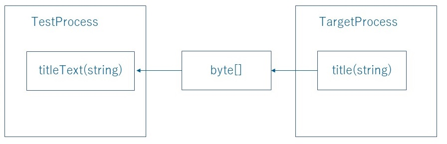

Friendly
========
For Japanese: [日本語](README.jp.md)

Friendly is a library for creating integration tests.<br>
It has the ability to manipulate other processes.<br>
It is currently designed for Windows Applications (**WinForms**, **WPF**, and **Win32**).<br>
The name Friendly is derived from the C++ friend class. <br>
Being friends gives you access to what you normally wouldn't be able to do.<br>

## Friendly support .NetCore.
Friendly can also operate .NetCore WinForms and WPF apps. But please write the test code in .Net Framework. Sorry.

## Features ...
#### Invoke separate process's API.
It's like a selenium's javascript execution.<br>
All Methods, Properties and Fields can be called regardless of being public internal protected private.
#### DLL injection.
It can inject .net assembly. And can execute inserted methods.

## Getting Started
Install from NuGet<br>
WPF

    PM> Install-Package RM.Friendly.WPFStandardControls

WinForms

    PM> Install-Package Ong.Friendly.FormsStandardControls

Win32    

    PM> Install-Package Codeer.Friendly.Windows.NativeStandardControls


## We win 2nd place at Microsoft MVP Showcase. Thank you!
http://blogs.msdn.com/b/mvpawardprogram/archive/2014/11/04/mvp-showcase-winners.aspx

## Simple sample
Here is some sample code to show how you can get started with Friendly.
This is a perfect ordinary Windows Application that is manipulation target.
(There is no kind of trick.)
```xaml
<Window x:Class="Target.MainWindow"
        xmlns="http://schemas.microsoft.com/winfx/2006/xaml/presentation"
        xmlns:x="http://schemas.microsoft.com/winfx/2006/xaml"
        Title="MainWindow" Height="350" Width="525">
    <Grid>
        <TextBox x:Name="_textBox" Text="{Binding Path=TextData}"/>
    </Grid>
</Window>
```
```cs  
using System.ComponentModel;
using System.Windows;

namespace Target
{
    public partial class MainWindow : Window
    {
        public MainWindow()
        {
            InitializeComponent();
            this.DataContext = new VM();
        }

        string MyFunc(int value)
        {
            return value.ToString();
        }
    }

    class VM : INotifyPropertyChanged
    {
        public event PropertyChangedEventHandler PropertyChanged = (_, __) => { };

        string _textData;
        public string TextData
        {
            get { return _textData; }
            set
            {
                _textData = value;
                PropertyChanged(this, new PropertyChangedEventArgs(nameof(TextData)));
            }
        }
    }
}
```
This is a test application (using VSTest):
```cs  
using Codeer.Friendly.Dynamic;
using Codeer.Friendly.Windows;
using Microsoft.VisualStudio.TestTools.UnitTesting;
using System.Diagnostics;
using System.IO;
using System.Windows;

namespace Sample
{
    [TestClass]
    public class Test
    {
        WindowsAppFriend _app;

        [TestInitialize]
        public void TestInitialize()
        {
            //attach to target process!
            var path = Path.GetFullPath("../../../Target/bin/Debug/Target.exe");
            _app = new WindowsAppFriend(Process.Start(path));
        }

        [TestCleanup]
        public void TestCleanup()
        {
            Process process = Process.GetProcessById(_app.ProcessId);
            _app.Dispose();
            process.CloseMainWindow();
        }

        [TestMethod]
        public void Manipulate()
        {           
            //static method
            dynamic window = _app.Type<Application>().Current.MainWindow;

            //instance method
            string value = window.MyFunc(5);
            Assert.AreEqual("5", value);

            //instance property
            window.DataContext.TextData = "abc";

            //instance field.
            string text = window._textBox.Text;
            Assert.AreEqual("abc", text);
        }
    }
}
```
## Friendly packages.
It's a very powerful feature. With .Net knowledge, most operations are possible.<br>
However, since it is difficult to write all tests with just this, we have prepared more convenient libraries.<br>


### [Infrastructure](#Friendly-Infrastructure)<br>
It call another process's api. And it injection .net dlls.<br>
Other Friendly libraries are built on top of this feature.<br>

### [Friendly.Windows.Grasp](https://github.com/Codeer-Software/Friendly.Windows.Grasp)<br>
TIt mainly provides a function to search for windows. <br>
Others provide basic Win32 level operations for Window that have Window handles.<br>

### [Friendly.Windows.KeyMouse](https://github.com/Codeer-Software/Friendly.Windows.KeyMouse)<br>
Low level key mouse emulation<br>
Timing is adjusted using the Friendly feature.<br>

### Control Drivers<br>
Provides operations for basic controls such as Button and TextBox.<br>

#### basic<br>
[Friendly.Windows.NativeStandardControls(Win32)](https://github.com/Codeer-Software/Friendly.Windows.NativeStandardControls)<br>
[Friendly.FormsStandardControls(WinForms)](https://github.com/ShinichiIshizuka/Ong.Friendly.FormsStandardControls)<br>
[Friendly.WPFStandardControls(WPF)](https://github.com/Roommetro/Friendly.WPFStandardControls/)<br>

#### 3rd party cotnrols<br>
[Friendly.XamControls(WPF)](https://github.com/Codeer-Software/Friendly.XamControls)<br>
[Friendly.FarPoint(WinForms)](https://github.com/Codeer-Software/Friendly.XamControls)<br>
[Friendly.C1.Win(WinForms)](https://github.com/Codeer-Software/Friendly.C1.Win)<br>

For example, you'll use these when manuplate with WPF apps.<br>
Friendly.Windows.Grasp<br>
Friendly.WPFStandardControls<br>
Friendly.NativeStandardContorls<br>

```cs  
using System.Diagnostics;
using System.IO;
using Codeer.Friendly;
using Codeer.Friendly.Dynamic;
using Codeer.Friendly.Windows;
using Codeer.Friendly.Windows.Grasp;
using Microsoft.VisualStudio.TestTools.UnitTesting;
using RM.Friendly.WPFStandardControls;

namespace Scenario
{
    [TestClass]
    public class Test
    {
        WindowsAppFriend _app;

        [TestInitialize]
        public void TestInitialize()
        {
            var path = Path.GetFullPath(Path.Combine(Path.GetDirectoryName(GetType().Assembly.Location), "../../../DemoApp/bin/Debug/DemoApp.exe"));
            var info = new ProcessStartInfo(path) { WorkingDirectory = Path.GetDirectoryName(path) };
            _app = new WindowsAppFriend(Process.Start(info));
        }

        [TestCleanup]
        public void TestCleanup() => Process.GetProcessById(_app.ProcessId).Kill();

        [TestMethod]
        public void Sample()
        {
            // get by type full name from target process's windows.
            var window = _app.WaitForIdentifyFromTypeFullName("DemoApp.Views.MainWindow");

            // get by field.(Friendly's infrastructure function)
            AppVar userControl = window.Dynamic()._userControl;

            // get by binding.
            WPFDataGrid dataGrid = userControl.LogicalTree().ByBinding("SelectedItem.Value").Single().Dynamic();

            // edit.
            dataGrid.EmulateChangeCellText(1, 2, "abc");

            // * This sample code was written mixed, 
            //   But usually, the scenario and specific logic of screen element are separated like the page object pattern of Selenium.
        }
    }
}
```

## Friendly Infrastructure
Here, we will explain the basic functions of Friendly.
It's about another process's API call and DLL injection.

#### Attention! Match the Processor Architecture. (x86 or x64)
The target and test processes must use the same processor architectue.
If you are using VSTest, you can set this by using the Visual Studio menus as shown below.<br>


#### Using Statements
```cs  
using Codeer.Friendly;
using Codeer.Friendly.Dynamic;
using Codeer.Friendly.Windows;
```
#### Connection to Execution Thread
Attach using WindowsAppFriend.
Operations can be executed on the main window thread:
```cs  
public WindowsAppFriend(Process process);
```
Operation can also be executed on a specified window thread:
```cs  
public WindowsAppFriend(IntPtr windowHandle);
```
#### Invoking Static Operations(Any OK)
```cs  
dynamic sampleForm1 = _app.Type<Application>().Current.MainWindow;

dynamic sampleForm2 = _app.Type(typeof(Application)).Current.MainWindow;

dynamic sampleForm4 = _app.Type("System.Windows.Forms.Application").Current.MainWindow;
```
#### Invokeing Instance Operations
```cs  
//method
string value = window.MyFunc(5);

//property
window.DataContext.TextData = "abc";

//field.
string text = window._textBox.Text;
```
See [here](#Friendly-interface) for more details on the interface.

#### Instantiating New Objects(Any OK)
```cs  
dynamic listBox1 = _app.Type<ListBox>()();

dynamic listBox2 = _app.Type(typeof(ListBox))();

dynamic listBox4 = _app.Type("System.Windows.Controls.ListBox")();

dynamic list = _app.Type<List<int>>()(new int[]{1, 2, 3, 4, 5});
```

#### Rules for Arguments
You can use serializable objects / AppVar / DynamicAppVar.<br>
If you use serializable objects, they will be serialized and a copy will be sent to the target process. <br>
See [here](#Friendly-interface) for AppVar / DynamicAppVar detail。
```cs  
// serializable object
window.MyFunc(5);
window.DataContext.TextData = "abc";

// new instance in target process. textBox is DynamicAppVar.
dynamic textBox = _app.Type<TextBox>()();

// DynamicAppVar
window.Content.Children.Add(textBox);
```

#### Rules for Return Values
```cs  
// DyanmicAppVar, referenced object exists in target process' memory. 
dynamic reference = window._textBox.Text;

// when you perform a cast, it will be marshaled from the target process.
string text = reference;
```

#### Note the Casting Behavior
```cs  
// OK
string cast = (string)reference;

// OK
string substitution = reference;

// No good. Result is false.
bool isString = reference is string;

// No good. Result is null.
string textAs = reference as string;

// No good. Throws an exception.
string.IsNullOrEmpty(reference);

// OK
string.IsNullOrEmpty((string)reference);
```

#### Special Convert
IEnumerable
```cs  
foreach (var w in _app.Type<Application>().Current.Windows)
{
}
```
AppVar
```cs  
dynamic window = _app.Type<Application>().Current.MainWindow;

AppVar appVar = window;
appVar["Title"]("abc");
```
AppVar is part of the old style interface.<br>
You will need to use AppVar if you use the old interface or if you can't use the .NET framework 4.0.<br>
It will also use in the Friendly libraries interface. Please refer [here](#Friendly-interface).<br>

DynamicAppVar can be implicitly converted to a class that has a constructor that takes AppVar as one argument.<br>
```cs 
var window = app.Type<Application>();
//pulbic WPFDataGrid(AppVar src)
WPFDataGrid dataGrid = new WPFDataGrid(window._dataGrid);

//can convert!
WPFDataGrid dataGrid =　window._dataGrid;
```

#### Async
Friendly operations are executed synchronously.
But you can use the Async class to execute them asynchronously.
```cs  
// Async can be specified anywhere among the arguments.
var async = new Async();
window.MyFunc(async, 5);

// You can check whether it has completed.
if (async.IsCompleted)
{
    //・・・
}

// You can wait for it to complete.
async.WaitForCompletion();
```

You can get the return value when the process is completed.
```cs  
// Text will obtain its value when the operation completes.
var async = new Async();
var text = window.MyFunc(async, 5);

// When the operation finishes, the value will be available.
async.WaitForCompletion();
string textValue = (string)text;
```
#### Copy() and Null()
```cs  
Dictionary<int, string> dic = new Dictionary<int, string>();
dic.Add(1, "1");

// Object is serialized and a copy will be sent to the target process 
dynamic dicInTarget = _app.Copy(dic);
            
// Null is useful for out arguments
dynamic value = _app.Null();
dicInTarget.TryGetValue(1, value);
Assert.AreEqual("1", (string)value);
```
#### Dll injection.
```cs  
[TestMethod]
public void DllInjection()
{
    dynamic window = _app.Type<Application>().Current.MainWindow;
    dynamic textBox = window._textBox;

    //Causes the specified assembly to be loaded into the target process.
    _app.LoadAssembly(GetType().Assembly);

    //You can use the type contained in the loaded assembly in the target process.
    dynamic observer = _app.Type<Observer>()(textBox);

    //Check change text.
    textBox.Text = "abc";
    Assert.IsTrue((bool)observer.TextChanged);
}

class Observer
{
    internal bool TextChanged { get; set; }
    internal Observer(TextBox textBox)
    {
        textBox.TextChanged += delegate { TextChanged = true; };
    }
}
```

Native dll methods.
```cs  
[TestMethod]
public void DllInjectionPInvoke()
{
    WindowsAppExpander.LoadAssembly(_app, GetType().Assembly);

    Process process = Process.GetProcessById(_app.ProcessId);
    _app.Type(GetType()).MoveWindow(process.MainWindowHandle, 0, 0, 200, 200, true);

    dynamic rectInTarget = _app.Type<RECT>()();
    _app.Type(GetType()).GetWindowRect(process.MainWindowHandle, rectInTarget);
    RECT rect = (RECT)rectInTarget;

    Assert.AreEqual(0, rect.left);
    Assert.AreEqual(0, rect.top);
    Assert.AreEqual(200, rect.right);
    Assert.AreEqual(200, rect.bottom);
}

[DllImport("User32.dll")]
static extern bool MoveWindow(IntPtr handle, int x, int y, int width, int height, bool redraw);

[DllImport("user32.dll")]
[return: MarshalAs(UnmanagedType.Bool)]
static extern bool GetWindowRect(IntPtr hwnd, out RECT lpRect);

[Serializable]
[StructLayout(LayoutKind.Sequential)]
internal struct RECT
{
    public int left;
    public int top;
    public int right;
    public int bottom;
}
```

## Friendly interface
Friendly was initially designed to work with .Net 2.0.<br>
That's why we used to make calls like this.<br>
```cs  
//old style
AppVar mainWindow = app[typeof(Application), "Current"]()["MainWindow"]();
string title = (string)mainWindow["Title"]().Core;
```

Since I started using dynamic in .Net 4.0, I can write like this.
```cs  
//new style
dynamic mainWindow = app.Type<Application>().Current.MainWindow;
string title = mainWindow.Title;
```

You generally shouldn't need to use a version older than .Net 4.0, so you should write your code in the new style.<br>
However, AppVar will continue to be used for the library interface because dynamic is not optimal for function arguments or return values.<br>

### Codeer.Friendly.Dynamic
Friendly finally executes the API in the target process using reflection.<br>
Therefore, the operation is specified by a character string.<br>
In the above example, it is a property, but for example, a function call is written like this.<br>
The function name was specified as a character string in [], and the argument was passed in the following ().<br>
```cs  
mainWindow["MyFunc"](100);
```
However, this is not very intuitive.<br>
Since .Net4.0 can use dynamic, DynamicAppType and DynamicAppVar were introduced.<br>
As a result, it became possible to write intuitively like the new style above.<br>
```cs  
using Codeer.Friendly.Dynamic;
```
Extension method can be used by using Codeer.Friendly.Dynamic namespace.<br>
```cs  
AppVar mainWindow1 = app[typeof(Application), "Current"]()["MainWindow"]();

//1. Dynamic() AppVar -> dynamic(DynamicAppVar)
dynamic mainWindow2 = mainWindow1.Dynamic();

//2. Type()
dynamic applicationType = app.Type<Application>();
dynamic mainWindow3 = applicationType.Current.MainWindow;
```
Both DynamicAppType and DynamicAppVar are returned as dynamic(DynamicAppVar) as the return value for API calls.<br>
So after that you can call the API as if it were a normal .Net object in the same process.<br>

### DynamicAppVar & AppVar
DynamicAppVar and AppVar can be converted to each other.<br>
There are some Friendly libraries that take AppVar as an argument.<br>
If you put DynamicAppVar here, it works fine.<br>

```cs 
var window = app.Type<Application>();
//pulbic WPFDataGrid(AppVar src)
WPFDataGrid dataGrid = new WPFDataGrid(window._dataGrid);
```


### Converting DynamicAppVar to other types

```cs 
dynamic mainWindow = app.Type<Application>().Current.MainWindow;

//DynamicAppVar
//title is in the target process at this point
dynamic title = mainWindow.Title;

//At this point, it will be serialized into a byte array and come to the this process
string titleText = title;
```



#### Frequently asked exceptions
```cs 
dynamic windowSrc = app.Type<Application>().Current.MainWindow;

//Oops! Exception occurred!
Window windowDst = windowSrc;

//[Codeer.Friendly.FriendlyOperationException]
//Communication with the application failed.
//The target applcation may be unreachable or you may be trying to send
//data that cannot be serialized.
```

This happens because the Window class cannot be serialized. <br>
Please use such objects as DynamicAppVar.<br>

