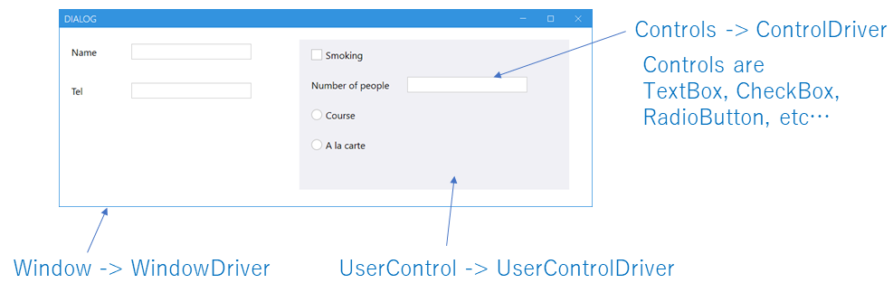
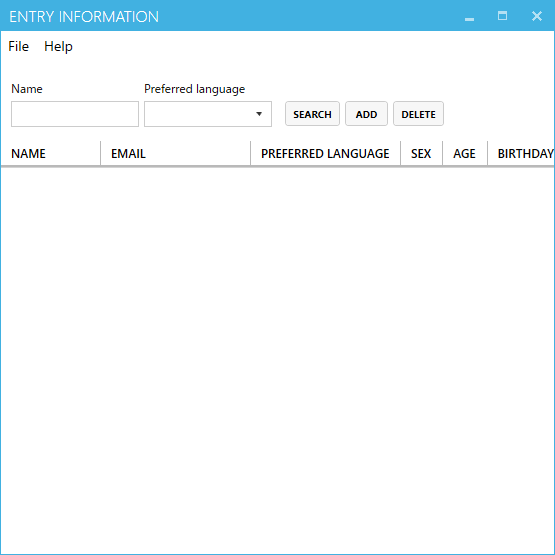
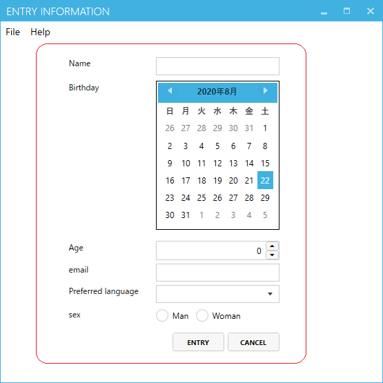

Driver/Scenarioパターン
========

ここでは我々がWindowsアプリケーションの自動システムテストを構築するときに使っている設計方針を紹介します。
自動テストを作成するということはテストを自動で実行するソフトウェアを開発するということです。
そして対象のアプリと同じだけのライフサイクルがあり多くの場合は長期にわたってメンテナンスしていきます。
以下のポイントに気を付けて費用対効果を高める必要があります。

+ 作成効率
+ メンバーのアサイン
+ メンテナンス性

基本方針はDriverとScenarioに分けて実装するというものです。
これはWebアプリをSeleniumでテストするときのページオブジェクトパターンに似ています。
Driver他プロセスを操作するモジュールでScenarioはテストを記述するモジュールです。


# Scenario
Scenarioはテストケースです。アプリケーションの操作とその後の状態の検証を行います。
これは通常はテストチームが手動で行っていたもので、それをコードで表現したものです。
Scenarioはメイン業務がテストの人でも記述できるようにすべきです。
制御文は可能な限り入れず理解しやすいAPIでの操作とAssertで記述できるようにします。
DriverとScenarioでは圧倒的にScenarioのボリュームが多くなります。
またScenarioを記述するときは技術的なことよりもアプリ/テストの仕様に集中できるようにする必要があります。
サンプルコードです。
```cs 
[TestMethod]
public void Sample()
{
    //操作
    //ボタン押下、テキスト入力などのシンプルなコントロール操作のみ
    var mainWindow = _app.AttachMainWindow();
    mainWindow.Add.EmulateClick();
    var entryControl = mainWindow.AttachEntryControl();
    entryControl.Name.EmulateChangeText("ishikawa");
    entryControl.Birthday.EmulateChangeDate(new DateTime(1977, 1, 7));
    entryControl.Age.EmulateChangeValue(42);
    entryControl.email.EmulateChangeText("ishikawa@xxx.com");
    entryControl.Preferredlanguage.EmulateChangeSelectedIndex(2);
    entryControl.Man.EmulateCheck(true);
    entryControl.Entry.EmulateClick();

    //Assert
    mainWindow.DataGrid.GetCellText(0, 0).Is("ishikawa");
    mainWindow.DataGrid.GetCellText(0, 1).Is("ishikawa@xxx.com");
    mainWindow.DataGrid.GetCellText(0, 2).Is("C#");
    mainWindow.DataGrid.GetCellText(0, 3).Is("Man");
    mainWindow.DataGrid.GetCellText(0, 4).Is("42");
    mainWindow.DataGrid.GetCellText(0, 5).Is("1977/01/07");
}
```
このコードの特徴は複雑な制御文がなく、上から下に操作とその後の判定を書いていることです。
トレーニングは必要ですが専門職のプログラマーでなくても書くことができます。 
自動テスト設計ではこのように要員の確保のしやすさも考慮に入れる必要があります。
画面要素の特定などはここには出てきません。
外部仕様だけで記述しています。
そのため内部の設計やコントロールの位置が変わったくらいではシナリオのメンテナンスは発生しません。
もちろん外部仕様が変わってしまった場合は書き直す必要があります。

# Driver (ControlDriver, WindowDriver/UserControlDriver)
Driverは逆にあまりテストのことは考えずに対象プロセスを制御することに集中します。
そして技術的なことやアプリの内部仕様に関してはこのレイヤに隠蔽します。
Driverはさらに大きくは二種類に分かれます。
ControlDriverとWindowDriver/UserControlDriverです。
ControlDriver,WindowDriver,UserControlDriverなら3種類じゃないのかと感じられると思いますが、
WindowDriver/UserControlDriverは同一の性質を持ちます。
それはWindowとUserControlが同じ性質を持つのと同じです。
WindowとUserControlはともに子となる要素(Control/UserControl)をデザイナやXamlで並べていきます
WindowDriver/UserControlDriverは子となる要素を特定/取得することがその責務です。
対してContorlはそれ自体が独立した機能を持っています。
多くの場合は汎用性が高く様々なWindow/UserControlで使われます。
ControlDriverは対象のコントロールの機能を操作することが責務です。
そのしてWindowDriver/UserControlDriverのプロパティとして特定した要素を操作することに使われます



## ControlDriver
ControlDriverは Button, ListView, TreeView などの基本的なコントロール単位での操作を提供します。
ControlDriverは汎用的なもので使いまわすことができます。
一般的なコントロールに関してはFriendlyの関連ライブラリで既に実装したものがありますのでそれをご利用ください。
プロジェクト固有のコントロールや3rdパーティ製のコントロールに関してはそれぞれで実装する必要があります。
ControlDriverの実装は難易度が高いです。
それぞれのControlに関しての知識が求められます。
ただ、それがあればFriendlyの基本機能を使えばほとんどのものが実装可能です。

例えばこのようなカスタムコントロールがあった場合(WPFにはNumericUpDownはありません)


```cs 
public class NumericUpDownControl : Control
{
    public TextBox ValueTextBox { get; set; }
    public RepeatButton UpButton { get; set; }
    public RepeatButton DownButton { get; set; }

    //以下省略
``` 

そのコントロールドライバは以下のようになります。
Friendlyの基本機能を使えば問題なく作成できます。
```cs 
using Codeer.Friendly;
using Codeer.Friendly.Dynamic;

namespace Driver.CustomDrivers
{
    public class WPFNumericUpDownDriver : IAppVarOwner
    {
        public AppVar AppVar { get; }

        public WPFNumericUpDownDriver(AppVar src) => AppVar = src;

        public int Value => this.Dynamic().Value;

        public void EmulateChangeValue(int value)
        {
            var textBox = this.Dynamic().ValueTextBox;
            textBox.Focus();
            textBox.Text = value.ToString();
        }
    }
}
```
## WindowDriver/UserControlDriver
WindowDriver/UserControlDriverは各Window/Form/UserControl/Pageのドライバです。

WindowやForm自体は通常ButtonやTextBoxなどのControlをレイアウトして作成されます。
そのためWindowDriverはレイアウトされたControlを特定/取得し、ControlDriverでラップして提供することが目的となります。
WindowDriver/UserControlDriverは対象の性質上使いまわすことはほとんどなく、対象のWindow/UserControlに対し一点ものになります。

WindowDriverを実装する際は各Windowの情報が必要になります。
具体的にはフィールド名やWPFならバインディング名などControlを特定するための情報です。
ここで必要なものは.Netの知識よりそのアプリの実装/設計に関する情報です。
WinFormsならフィールドで簡単に特定できることが多いのですが、WPFではx:nameがついていないことも多く、Win32の場合はそもそも.netではないのでフィールドは使えません。
そのような場合のためにライブラリでいくつか特定するためのメソッドを用意しているのでそれを使ってください。
これでもダメな場合でもFriendlyの基本を理解すれば自分で新たな特定方法を作ることができます。
+ [WPF](https://github.com/Roommetro/Friendly.WPFStandardControls/)
+ [Win32](https://github.com/Codeer-Software/Friendly.Windows.Grasp)

WindowDriverの例です。


```cs 
using Codeer.Friendly.Dynamic;
using Codeer.Friendly.Windows;
using Codeer.Friendly.Windows.Grasp;
using RM.Friendly.WPFStandardControls;

namespace Driver.Windows
{
    public class MainWindowDriver
    {
        //MainWindow自体を操作するためのWindowControl
        public WindowControl Core { get; }

        //タイプで特定
        public WPFMenuBase Menu => Core.LogicalTree().ByType("System.Windows.Controls.Menu").Single().Dynamic();

        //フィールドで特定
        public WPFTextBox Name => thid.Dynamic()._textBoxName;

        //バインディングで特定
        public WPFComboBox Preferredlanguage => Core.LogicalTree().ByBinding("LanguageSearch.Value").Single().Dynamic();
        public WPFDataGrid DataGrid => Core.LogicalTree().ByBinding("SelectedItem.Value").Single().Dynamic();

        //文字列で特定
        public WPFButtonBase Search => Core.LogicalTree().ByType("System.Windows.Controls.Button").ByType<ContentControl>().ByContentText("Search").Single().Dynamic();
        public WPFButtonBase Add => Core.LogicalTree().ByType("System.Windows.Controls.Button").ByType<ContentControl>().ByContentText("Add").Single().Dynamic();
        public WPFButtonBase Delete => Core.LogicalTree().ByType("System.Windows.Controls.Button").ByType<ContentControl>().ByContentText("Delete").Single().Dynamic();

        public MainWindowDriver(WindowControl core) => Core = core;
    }
}
```

UserControlDriverもほぼ同じ実装方法になります。


```cs
using Codeer.Friendly;
using Codeer.Friendly.Dynamic;
using RM.Friendly.WPFStandardControls;
using Driver.CustomDrivers;
using System.Windows.Controls;

namespace Driver.Windows
{
    public class EntryControlDriver
    {
        //EntryControl自体を操作するためのWPFUserControl
        public WPFUserControl Core { get; }

        public WPFTextBox Name => Core.Dynamic()._textBoxName;
        public WPFContextMenu NameContextMenu => new WPFContextMenu{Target = Name.AppVar};
        public WPFTextBox email => Core.LogicalTree().ByBinding("Mail.Value").Single().Dynamic();
        public WPFContextMenu emailContextMenu => new WPFContextMenu{Target = email.AppVar};
        public WPFComboBox Preferredlanguage => Core.LogicalTree().ByBinding("Language.Value").Single().Dynamic();
        public WPFToggleButton Man => Core.LogicalTree().ByBinding("IsMan.Value").Single().Dynamic();
        public WPFToggleButton Woman => Core.LogicalTree().ByBinding("IsWoman.Value").Single().Dynamic();
        public WPFCalendar Birthday => Core.LogicalTree().ByBinding("BirthDay.Value").Single().Dynamic();
        public WPFNumericUpDownDriver Age => Core.LogicalTree().ByBinding("Age.Value").Single().Dynamic();
        public WPFButtonBase Entry => Core.LogicalTree().ByType("System.Windows.Controls.Button").ByType<ContentControl>().ByContentText("Entry").Single().Dynamic();
        public WPFButtonBase Cancel => Core.LogicalTree().ByType("System.Windows.Controls.Button").ByType<ContentControl>().ByContentText("Cancel").Single().Dynamic();

        public EntryControlDriver(AppVar core)
            => Core = new WPFUserControl(core);
    }
}
```

### Attach
Attachは対象のWindow/UserControlを検索し、WindowDriver/UserControlDriverを生成するコードになります。
これもシナリオ中に書くと可読性/メンテナンス性が下がるためドライバの一部として実装します。
我々はこれを拡張メソッドで実装しています。
引数で渡した対象から目的のWindow/UserControlを検索しDriverを生成しています。
下記の例ではWindowsAppFriend(アプリケーション全体)からDemoApp.Views.MainWindowを.Netの型名称を使って検索しMainWindowDriverを生成しています。

```cs 
//Attachを拡張メソッドとして提供する
public static class MainWindowDriverExtensions
{
    //アプリケーション全体から検索
    public static MainWindowDriver AttachMainWindow(this WindowsAppFriend app)
        => app.WaitForIdentifyFromTypeFullName("DemoApp.Views.MainWindow").Dynamic();
}
```
```cs
[TestMethod]
public void Sample()
{
    //Attach
    var mainWindow = _app.AttachMainWindow();
    
    //以下操作
    mainWindow.Name.EmulateChangeText("ishikawa");
```

UserControlの場合はAttachを使わずに、それを保持する親のWindowDriverのプロパティとして取得することも多いです。
```cs
public class MainWindowDriver
{
    public WindowControl Core { get; }

    //親ウィンドウのプロパティとして取得
    public EntryControlDriver EntryControl => Core.Dynamic()._entryControl;

    public MainWindow_Driver(WindowControl core) => Core = core;
}
```
Attachを作成する場合もあります。
どちらを使っても構いません。
UserControlが常に表示されている場合はWindowDriverのプロパティを使い、条件によって表示/非表示が切り替わるものに関してはAttachを使うことが多いです。
以下の例はMainWindowDriver(DemoApp.Views.MainWindow)からDemoApp.Views.EntryControlを検索して存在していればEntryControlDriverを生成するコードです。
```cs
public static class EntryControlDriverExtensions
{
    //MainWindowDriver(DemoApp.Views.MainWindow)から検索
    public static EntryControlDriver AttachEntryControl(this MainWindowDriver window)
        => window.Core.VisualTree().ByType("DemoApp.Views.EntryControl").SingleOrDefault()?.Dynamic();
}
```
UserControlでもアプリケーション全体から検索することもあります。ドッキングタイプのアプリの場合は親ウィンドウが定まりません。
以下の例ではアプリケーション中の全てのトップレベルウィンドウの中からDemoApp.OutputWindowを検索し存在していればOutputWindowDriverを生成しています。
```cs
public static class OutpuWindowDriverExtensions
{
    [UserControlDriverIdentify]
    public static OutpuWindowDriver AttachOutpuWindow(this WindowsAppFriend app)
        => app.GetTopLevelWindows().SelectMany(e => e.GetFromTypeFullName("DemoApp.OutputWindow")).FirstOrDefault()?.Dynamic();
}
```

検索条件を引数で渡すこともあります。同一タイプで複数存在している時にタイトルで特定するなどです。特定方法は状況によって最適なもににします。
```cs 
public static class DataWindowDriverExtensions
{
    public static DataWindowDriver AttachDataWindow(this WindowsAppFriend app, string title)
        => app.GetFromTypeFullName("DemoApp.Views.DataWindow").Where(e => e.GetWindowText() == title).Dynamic();
}
```

## プロジェクト構成
さらにそれぞれが操作時に対象プロセス内部で実行させる処理を実装するなら、その処理は別のdllに分ける方がおすすめです。
これは実装効率のためです。対象プロセスにロードさせるとそのプロセスが稼働中の間はそのdllを再度コンパイルすることができません。
対象プロセスにロードさせる処理は比較的少ないので、分けておくとプロセスが稼働している間にコンパイルすることができます。

最終的にはこのようなプロジェクト構成がおすすめです。


