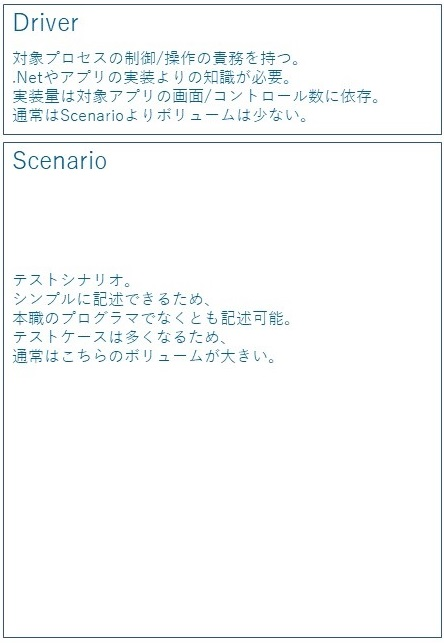
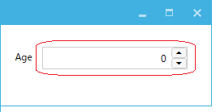
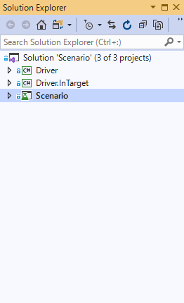

Windowsアプリケーションの自動テスト設計
========

ここでは我々がWindowsアプリケーションの自動システムテストを構築するときに使っている設計方針を紹介します。<br>
自動テストを作成するということはテストを自動で実行するソフトウェアを開発するということです。<br>
そして対象のアプリと同じだけのライフサイクルがあり多くの場合は長期にわたってメンテナンスしていきます。<br>
以下のポイントに気を付けて費用対効果を高める必要があります。<br>

+ 作成効率
+ メンバーのアサイン
+ メンテナンス性

基本方針はDriverとScenarioに分けて実装するというものです。<br>
これはWebアプリをSeleniumでテストするときのページオブジェクトパターンに似ています。<br>
Driver他プロセスを操作するモジュールでScenarioはテストを記述するモジュールです。<br>


# Scenario
Scenarioはメイン業務がテストの人でも記述できるようにすべきです。<br>
制御文は可能な限り入れず理解しやすいAPIでの操作とAssertで記述できるようにします。<br>
DriverとScenarioでは圧倒的にScenarioのボリュームが多くなります。<br>
またScenarioを記述するときは技術的なことよりもアプリ/テストの仕様に集中できるようにする必要があります。<br>
サンプルコードです。
```cs 
[TestMethod]
public void Sample()
{
    //操作
    var mainWindow = _app.AttachMainWindow();
    var allDisplayControl = mainWindow.AttachAllDisplayControl();
    allDisplayControl.Add.EmulateClick();
    var entryControl = mainWindow.AttachEntryControl();
    entryControl.Name.EmulateChangeText("ishikawa");
    entryControl.Birthday.EmulateChangeDate(new DateTime(1977, 1, 7));
    entryControl.Age.EmulateChangeValue(42);
    entryControl.email.EmulateChangeText("ishikawa@xxx.com");
    entryControl.Preferredlanguage.EmulateChangeSelectedIndex(2);
    entryControl.Man.EmulateCheck(true);
    entryControl.Entry.EmulateClick();

    //Assert
    allDisplayControl.DataGrid.GetCellText(0, 0).Is("ishikawa");
    allDisplayControl.DataGrid.GetCellText(0, 1).Is("ishikawa@xxx.com");
    allDisplayControl.DataGrid.GetCellText(0, 2).Is("C#");
    allDisplayControl.DataGrid.GetCellText(0, 3).Is("Man");
    allDisplayControl.DataGrid.GetCellText(0, 4).Is("42");
    allDisplayControl.DataGrid.GetCellText(0, 5).Is("1977/01/07");
}
```
このコードの特徴は複雑な制御文などはなく上から下に操作とその後の判定を書いているだけです。<br>
トレーニングは必要ですが専門職のプログラマーでなくても書くことはできます。<br>
自動テスト設計ではこのように要員の確保のしやすさも考慮に入れる必要があります。<br>
画面要素の特定などはここには出てきません。<br>
外部仕様だけで記述しています。<br>
そのため内部の設計が変わったくらいではシナリオのメンテナンスは発生しません。<br>
もちろん外部仕様が変わってしまった場合は書き直す必要があります。<br>

# Driver
Driverは逆にあまりテストのことは考えずに対象プロセスを制御することに集中します。<br>
そして技術的なことやアプリの内部仕様に関してはこのレイヤに隠蔽します。<br>
Driverはさらに大きくは二種類に分かれます。<br>
ControlDriverとWindowDriverです。<br>

## ControlDriver
ControlDriverは Button, ListView, TreeView などの基本的なコントロール単位での操作を提供します。<br>
ControlDriverは汎用的なもので使いまわすことができます。<br>
一般的なコントロールに関してはFriendlyの関連ライブラリで既に実装したものがありますのでそれをご利用ください。<br>
プロジェクト固有のコントロールや3rdパーティ製のコントロールに関してはそれぞれで実装する必要があります。<br>
ControlDriverの実装は難易度が高いです。<br>
それぞれのControlに関しての知識が求められます。<br>
ただ、それがあればFriendlyの基本機能を使えばほとんどのものが実装可能です。<br>
<br>
例えばこのようなカスタムコントロールがあった場合(WPFにはNumericUpDownはありません)<br>


```cs 
public class NumericUpDownControl : Control
{
    public TextBox ValueTextBox { get; set; }
    public RepeatButton UpButton { get; set; }
    public RepeatButton DownButton { get; set; }

    //以下省略
``` 

そのコントロールドライバは以下のようになります。<br>
Friendlyの基本機能を使えば問題なく作成できます。<br>
```cs 
using Codeer.Friendly;
using Codeer.Friendly.Dynamic;

namespace Driver.CustomDrivers
{
    public class WPFNumericUpDownDriver : IAppVarOwner
    {
        public AppVar AppVar { get; }

        public WPFNumericUpDownDriver(AppVar src) => AppVar = src;

        public int Value => this.Dynamic().Value;

        public void EmulateChangeValue(int value)
        {
            var textBox = this.Dynamic().ValueTextBox;
            textBox.Focus();
            textBox.Text = value.ToString();
        }
    }
}
```
## WindowDriver
WindowDriverは各Window/Form/UserControlのドライバです。<br>
（まとめてWindowDriverと呼ぶことにします。）<br>
<br>
WindowやForm自体は通常ButtonやTextBoxなどのControlをレイアウトして作成されます。<br>
そのためWindowDriverはレイアウトされたControlを取得し、ControlDriverでラップして提供することが目的となります。<br>
WindowDriverは対象の性質上使いまわすことはほとんどなく、対象のWindowに対し一点ものになります。<br>
ここがControlDriverと異なるところです。<br>
<br>
WindowDriverを実装する際は各Windowの情報が必要になります。<br>
具体的にはフィールド名やWPFならバインディング名などControlを特定するための情報です。<br>
ここで必要なものは.Netの知識よりそのアプリの実装/設計に関する情報です。<br>
WinFormsならフィールドで簡単に特定できることが多いのですが、WPFではx:nameがついていないことも多く、Win32の場合はそもそも.netではないのでフィールドは使えません。<br>
そのような場合のためにライブラリでいくつか特定するためのメソッドを用意しているのでそれを使ってください。<br>
これでもダメな場合でもFriendlyの基本を理解すれば自分で新たな特定方法を作ることも可能です。<br>
+ [WPF](https://github.com/Roommetro/Friendly.WPFStandardControls/)
+ [Win32](https://github.com/Codeer-Software/Friendly.Windows.Grasp)
<br>
それから、トップレベルのWindowではWindowDriverにはAttachするための拡張メソッドを作ります。<br>

```cs 
using Codeer.Friendly.Dynamic;
using Codeer.Friendly.Windows;
using Codeer.Friendly.Windows.Grasp;
using RM.Friendly.WPFStandardControls;

namespace Driver.Windows
{
    public class MainWindowDriver
    {
        public WindowControl Core { get; }

        //フィールドで特定
        public WPFTextBox Name => thid.Dynamic()._textBoxName;

        //タイプで特定
        public WPFMenuBase Menu => Core.LogicalTree().ByType("System.Windows.Controls.Menu").Single().Dynamic();

        //バインディングで特定
        public WPFComboBox Preferredlanguage => Core.LogicalTree().ByBinding("LanguageSearch.Value").Single().Dynamic();
        public WPFDataGrid DataGrid => Core.LogicalTree().ByBinding("SelectedItem.Value").Single().Dynamic();

        //文字列で特定
        public WPFButtonBase Search => Core.LogicalTree().ByType("System.Windows.Controls.Button").ByType<ContentControl>().ByContentText("Search").Single().Dynamic();
        public WPFButtonBase Add => Core.LogicalTree().ByType("System.Windows.Controls.Button").ByType<ContentControl>().ByContentText("Add").Single().Dynamic();
        public WPFButtonBase Delete => Core.LogicalTree().ByType("System.Windows.Controls.Button").ByType<ContentControl>().ByContentText("Delete").Single().Dynamic();

        public MainWindowDriver(WindowControl core) => Core = core;
    }

    //Attachを拡張メソッドとして提供する
    public static class MainWindowDriverExtensions
    {
        public static MainWindowDriver AttachMainWindow(this WindowsAppFriend app)
            => new MainWindowDriver(app.WaitForIdentifyFromTypeFullName("DemoApp.Views.MainWindow"));
    }
}
```
```cs
[TestMethod]
public void Sample()
{
    //Attach
    var mainWindow = _app.AttachMainWindow();
    
    //以下操作
    mainWindow.Name.EmulateChangeText("ishikawa");
```
トップレベルウィンドウ以外のUserControlなどへのWindowDriverの場合は二種類取得する方法が考えられます。<br>
```cs
using Codeer.Friendly;
using Codeer.Friendly.Dynamic;
using RM.Friendly.WPFStandardControls;
using Driver.CustomDrivers;
using System.Windows.Controls;

namespace Driver.Windows
{
    public class EntryControlDriver
    {
        public WPFUserControl Core { get; }
        public WPFTextBox Name => Core.Dynamic()._textBoxName;
        public WPFContextMenu NameContextMenu => new WPFContextMenu{Target = Name.AppVar};
        public WPFTextBox email => Core.LogicalTree().ByBinding("Mail.Value").Single().Dynamic();
        public WPFContextMenu emailContextMenu => new WPFContextMenu{Target = email.AppVar};
        public WPFComboBox Preferredlanguage => Core.LogicalTree().ByBinding("Language.Value").Single().Dynamic();
        public WPFToggleButton Man => Core.LogicalTree().ByBinding("IsMan.Value").Single().Dynamic();
        public WPFToggleButton Woman => Core.LogicalTree().ByBinding("IsWoman.Value").Single().Dynamic();
        public WPFCalendar Birthday => Core.LogicalTree().ByBinding("BirthDay.Value").Single().Dynamic();
        public WPFNumericUpDownDriver Age => Core.LogicalTree().ByBinding("Age.Value").Single().Dynamic();
        public WPFButtonBase Entry => Core.LogicalTree().ByType("System.Windows.Controls.Button").ByType<ContentControl>().ByContentText("Entry").Single().Dynamic();
        public WPFButtonBase Cancel => Core.LogicalTree().ByType("System.Windows.Controls.Button").ByType<ContentControl>().ByContentText("Cancel").Single().Dynamic();

        public EntryControlDriver(AppVar core)
            => Core = new WPFUserControl(core);
    }
}
```
一つ目はControlDriverと同様に親のWindowDriverのプロパティとする方法です。<br>
```cs
public class MainWindowDriver
{
    public WindowControl Core { get; }

    //親ウィンドウのプロパティとして取得
    public EntryControlDriver EntryControl => Core.Dynamic()._entryControl;

    public MainWindow_Driver(WindowControl core) => Core = core;
}
```
もう一つはWindowDriverにアタッチする拡張メソッドを作成する方法です。<br>
```cs
//拡張メソッドで取得
public static class EntryControlDriverExtensions
{
    public static EntryControlDriver AttachEntryControl(this MainWindowDriver window)
        => window.Core.VisualTree().ByType("DemoApp.Views.EntryControl").Single().Dynamic();
}
```
例えばMDIだったりWPFのページのように常に存在するわけではなかったり同一のウィンドウ/UserControlが複数存在する場合に向いています。<br>

また特殊な例でドッキングウィンドウのような場合、どの親ウィンドウが持っているかわからないようなケースでは<br>
トップレベルウィンドウでなくともWindowsAppFriendにアタッチする拡張メソッドを作ることもあります。<br>

さらにそれぞれが操作時に対象プロセス内部で実行させる処理を実装するなら、その処理は別のdllに分ける方がおすすめです。<br>
これは実装効率のためです。対象プロセスにロードさせるとそのプロセスが稼働中の間はそのdllを再度コンパイルすることができません。<br>
対象プロセスにロードさせる処理は比較的少ないので、分けておくとプロセスが稼働している間にコンパイルすることができます。<br>

最終的にはこのようなDll構成がおすすめです。<br>


