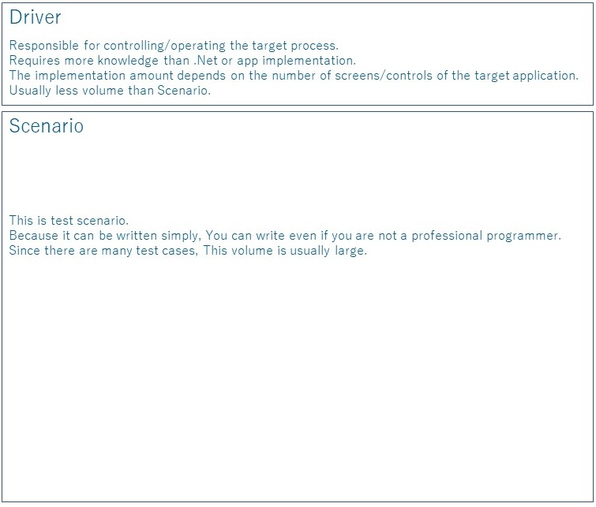

Automatic test design for Windows applications.
========

This document introduces the design principles we use when building automated system tests for Windows applications.<br>
Creating an automated test means developing software that automatically runs the test. <br>
And it has the same life cycle as the target application, and in many cases we will maintain it for a long time. <br>
You need to be aware of the following points to be cost effective. <br>

+ Creation efficiency
+ Member assignment
+ Maintainability

The basic policy is to implement it separately for Driver and Scenario. <br>
This is similar to the page object pattern when testing a web app with Selenium. <br>
Driver is a module that manipulates other processes. Scenario is a module that describes tests. <br>


# Scenario
Scenario should be able to be written even if the main task is a test person. <br>
When writing scenarios, use control statements as little as possible, and use simple API operations and Assert only. <br>
Compared to Driver and Scenario, the volume of Scenario is overwhelmingly large. <br>
Also, when writing a Scenario, you need to be able to focus on the app/test specifications rather than the technical things. <br>
Here is the sample code.
```cs 
[TestMethod]
public void Sample()
{
    //manipulation
    var mainWindow = _app.AttachMainWindow();
    var allDisplayControl = mainWindow.AttachAllDisplayControl();
    allDisplayControl.Add.EmulateClick();
    var entryControl = mainWindow.AttachEntryControl();
    entryControl.Name.EmulateChangeText("ishikawa");
    entryControl.Birthday.EmulateChangeDate(new DateTime(1977, 1, 7));
    entryControl.Age.EmulateChangeValue(42);
    entryControl.email.EmulateChangeText("ishikawa@xxx.com");
    entryControl.Preferredlanguage.EmulateChangeSelectedIndex(2);
    entryControl.Man.EmulateCheck(true);
    entryControl.Entry.EmulateClick();

    //Assert
    allDisplayControl.DataGrid.GetCellText(0, 0).Is("ishikawa");
    allDisplayControl.DataGrid.GetCellText(0, 1).Is("ishikawa@xxx.com");
    allDisplayControl.DataGrid.GetCellText(0, 2).Is("C#");
    allDisplayControl.DataGrid.GetCellText(0, 3).Is("Man");
    allDisplayControl.DataGrid.GetCellText(0, 4).Is("42");
    allDisplayControl.DataGrid.GetCellText(0, 5).Is("1977/01/07");
}
```
The feature of this code is that there are no complicated control statements, only the operation and the judgment that are written from top to bottom. <br>
Training is required, but non-professional programmers can write. <br>
Automated test design must also take into account the availability of personnel. <br>
The identification of screen elements does not appear here. <br>
It is described only by external specifications. <br>
Therefore, maintenance of the scenario does not occur even if the internal design changes. <br>
Of course, if the external specifications have changed, you need to rewrite. <br>

# Driver
The Driver concentrates on controlling the target process without thinking too much about testing. <br>
And it hides technical matters and internal specifications of the application in this layer. <br>
There are two main types of drivers. <br>
Control Driver and Window Driver. <br>

## ControlDriver
Control Driver provides basic operations for each control such as Button, ListView, TreeView. <br>
The Control Driver is a general-purpose type and can be reused. <br>
As for general controls, there is one already implemented in Friendly's related library, so please use it. <br>
Project specific controls and 3rd party controls must be implemented by each. <br>
Implementing ControlDriver is difficult. <br>
Knowledge of each Control is required. <br>
However, if you have it, you can implement most of it using the basic functions of Friendly. <br>
<br>
For example if you have a custom control like this (There is no NumericUpDown in WPF)<br>


```cs 
public class NumericUpDownControl : Control
{
    public TextBox ValueTextBox { get; set; }
    public RepeatButton UpButton { get; set; }
    public RepeatButton DownButton { get; set; }

    //Omitted below
``` 

The control driver for this is: <br>
You can create it without problems if you use the basic functions of Friendly. <br>
```cs 
using Codeer.Friendly;
using Codeer.Friendly.Dynamic;

namespace Driver.CustomDrivers
{
	public class WPFNumericUpDownDriver : IAppVarOwner
	{
		public AppVar AppVar { get; }

		public WPFNumericUpDownDriver(AppVar src) => AppVar = src;

		public int Value => this.Dynamic().Value;

		public void EmulateChangeValue(int value)
		{
			var textBox = this.Dynamic().ValueTextBox;
			textBox.Focus();
			textBox.Text = value.ToString();
		}
	}
}
```
## WindowDriver
This is the Window/Form/UserControl driver. <br>
(We will collectively call it Window Driver.)<br>
<br>
Window and Form itself are usually created by laying out Controls such as Button and TextBox. <br>
Therefore, the purpose of WindowDriver is to get the laid out Control and wrap it with ControlDriver to provide it. <br>
The WindowDriver is rarely reused due to the nature of the target, and there is only one for each target Window. <br>
This is the difference from Control Driver. <br>
<br>
Information on each window is required when implementing WindowDriver. <br>
Specifically, it is the information for identifying the Control such as the field name and the binding name in WPF. <br>
In WinForms, it is often easy to specify by field, but in WPF it is often that x:name is not attached, and in the case of Win32 it is not .net so the field cannot be used. <br>
For such cases, the library provides some specific methods for you to use. <br>
Even if this is not enough, if you understand the basics of Friendly, you can create a new identification method yourself. <br>
+ [WPF](https://github.com/Roommetro/Friendly.WPFStandardControls/)
+ [Win32](https://github.com/Codeer-Software/Friendly.Windows.Grasp)

The necessary knowledge is information about the implementation/design of the app from .Net. <br>
Create an extension method for Attach about WindowDriver of top-level Window. <br>

```cs 
using Codeer.Friendly.Dynamic;
using Codeer.Friendly.Windows;
using Codeer.Friendly.Windows.Grasp;
using RM.Friendly.WPFStandardControls;

namespace Driver.Windows
{
    public class MainWindowDriver
    {
        public WindowControl Core { get; }

        //get by field.
        public WPFTextBox Name => thid.Dynamic()._textBoxName;

        //get by type.
        public WPFMenuBase Menu => Core.LogicalTree().ByType("System.Windows.Controls.Menu").Single().Dynamic();

        //get by binding.
        public WPFComboBox Preferredlanguage => Core.LogicalTree().ByBinding("LanguageSearch.Value").Single().Dynamic();
        public WPFDataGrid DataGrid => Core.LogicalTree().ByBinding("SelectedItem.Value").Single().Dynamic();

        //get by text.
        public WPFButtonBase Search => Core.LogicalTree().ByType("System.Windows.Controls.Button").ByType<ContentControl>().ByContentText("Search").Single().Dynamic();
        public WPFButtonBase Add => Core.LogicalTree().ByType("System.Windows.Controls.Button").ByType<ContentControl>().ByContentText("Add").Single().Dynamic();
        public WPFButtonBase Delete => Core.LogicalTree().ByType("System.Windows.Controls.Button").ByType<ContentControl>().ByContentText("Delete").Single().Dynamic();

        public MainWindowDriver(WindowControl core) => Core = core;
    }

    //provide Attach as an extension method
    public static class MainWindowDriverExtensions
    {
        public static MainWindowDriver AttachMainWindow(this WindowsAppFriend app)
            => new MainWindowDriver(app.WaitForIdentifyFromTypeFullName("DemoApp.Views.MainWindow"));
    }
}
```
```cs
[TestMethod]
public void Sample()
{
    //attach
    var mainWindow = _app.AttachMainWindow();
    
    //manipulation
    mainWindow.Name.EmulateChangeText("ishikawa");
```
In the case of WindowDriver for UserControl other than top-level window, there are two ways to get it.<br>
```cs
using Codeer.Friendly;
using Codeer.Friendly.Dynamic;
using RM.Friendly.WPFStandardControls;
using Driver.CustomDrivers;
using System.Windows.Controls;

namespace Driver.Windows
{
    public class EntryControlDriver
    {
        public WPFUserControl Core { get; }
        public WPFTextBox Name => Core.Dynamic()._textBoxName;
        public WPFContextMenu NameContextMenu => new WPFContextMenu{Target = Name.AppVar};
        public WPFTextBox email => Core.LogicalTree().ByBinding("Mail.Value").Single().Dynamic();
        public WPFContextMenu emailContextMenu => new WPFContextMenu{Target = email.AppVar};
        public WPFComboBox Preferredlanguage => Core.LogicalTree().ByBinding("Language.Value").Single().Dynamic();
        public WPFToggleButton Man => Core.LogicalTree().ByBinding("IsMan.Value").Single().Dynamic();
        public WPFToggleButton Woman => Core.LogicalTree().ByBinding("IsWoman.Value").Single().Dynamic();
        public WPFCalendar Birthday => Core.LogicalTree().ByBinding("BirthDay.Value").Single().Dynamic();
        public WPFNumericUpDownDriver Age => Core.LogicalTree().ByBinding("Age.Value").Single().Dynamic();
        public WPFButtonBase Entry => Core.LogicalTree().ByType("System.Windows.Controls.Button").ByType<ContentControl>().ByContentText("Entry").Single().Dynamic();
        public WPFButtonBase Cancel => Core.LogicalTree().ByType("System.Windows.Controls.Button").ByType<ContentControl>().ByContentText("Cancel").Single().Dynamic();

        public EntryControlDriver(AppVar core)
            => Core = new WPFUserControl(core);
    }
}
```
The first is to use the property of the parent Window Driver.<br>
```cs
public class MainWindowDriver
{
    public WindowControl Core { get; }

    //parent window's propery.
    public EntryControlDriver EntryControl => Core.Dynamic()._entryControl;

    public MainWindow_Driver(WindowControl core) => Core = core;
}
```
The other is to create an extension method that attaches to WindowDriver.<br>
```cs
//get by extension method. 
public static class EntryControlDriverExtensions
{
    public static EntryControlDriver AttachEntryControl(this MainWindowDriver window)
        => window.Core.VisualTree().ByType("DemoApp.Views.EntryControl").Single().Dynamic();
}
```
This is suitable for cases where MDI or WPF pages do not always exist or there are multiple windows/UserControls that are the same.<br>
In some cases, like docking windows, where you don't know which parent window it has, <br>
you may want to create an extension method that attaches to WindowsAppFriend even if it's not the top-level window.<br>
If you want to implement the process to be executed inside the target process at the time of manipulation, it is recommended to divide the process into another dll. <br>
This is for implementation efficiency. When loaded into the target process, the dll cannot be recompiled while the process is running. <br>
Since there is relatively little work to load in the target process, if you keep it separate, you can compile while the process is running. <br>

Ultimately, we recommend this Dll configuration.<br>


